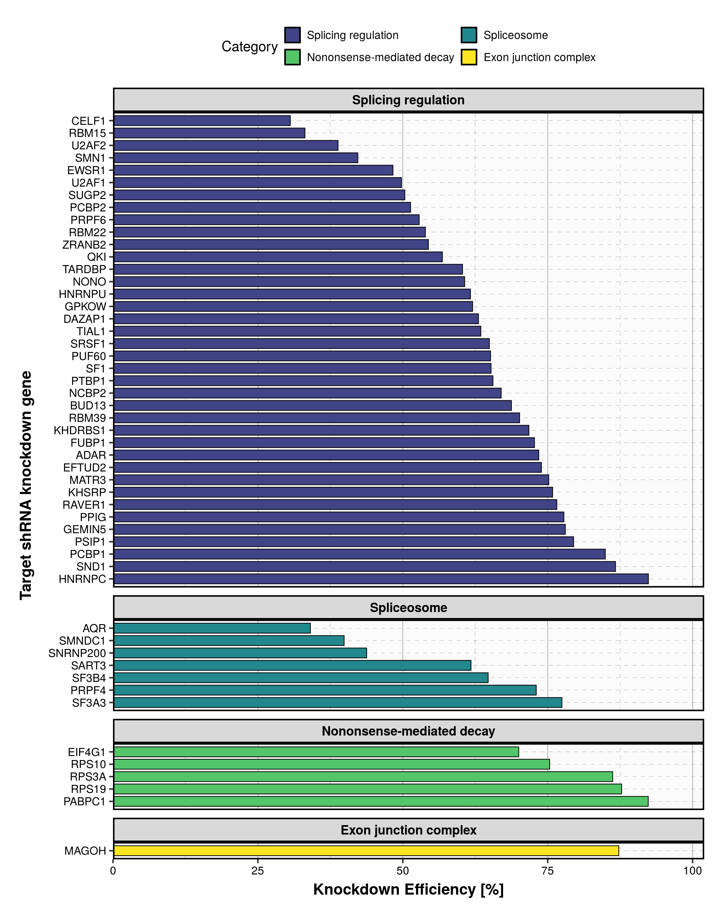
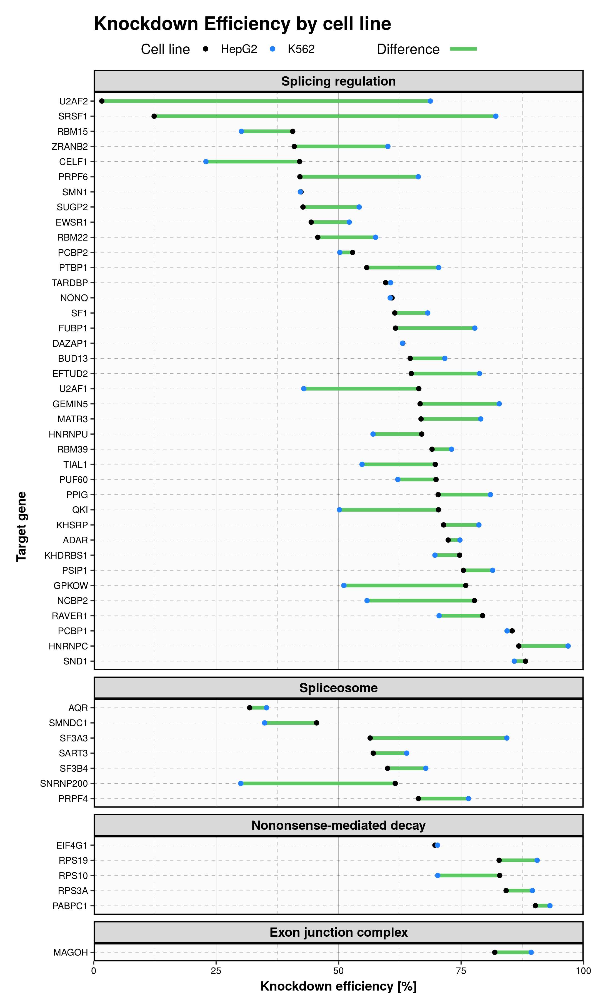

- [Methods](#methods)
- [Steps](#steps)
  - [Step 1: Load previous metadata and set script parameters](#step-1-load-previous-metadata-and-set-script-parameters)
  - [Step 2: Download the `gene_quantification` files](#step-2-download-the-gene_quantification-files)
  - [Step 3: TPM extraction](#step-3-tpm-extraction)
  - [Step 4: Estimating the Knockdown Efficiency](#step-4-estimating-the-knockdown-efficiency)
- [Results](#results)
  - [Knockdown Efficiency](#knockdown-efficiency)
  - [Cell line influence](#cell-line-influence)

<style type="text/css">
body{
  font-size: 12pt;
}
h1{
  font-size: 24pt;
}
</style>
<!-- ```{r setup-variables, include = F} -->
<!-- metadata_path <- path.expand("~/RytenLab-Research/02-ENCODE_API/Metadata_results/metadata_combined.tsv") -->
<!-- metadata <- readr::read_delim(metadata_path, show_col_types = F) %>% as_tibble() -->
<!-- metadata_kEff_path <- path.expand("~/RytenLab-Research/02-ENCODE_API/Metadata_results/metadata_kEff.tsv") -->
<!-- metadata_kEff <- readr::read_delim(metadata_kEff_path, show_col_types = F) %>% as_tibble() -->
<!-- metadata_kEff_PCR_path <- path.expand("~/RytenLab-Research/02-ENCODE_API/Metadata_results/metadata_kEff_qt-PCR.tsv") -->
<!-- metadata_kEff_PCR <- readr::read_delim(metadata_kEff_PCR_path, show_col_types = F) %>% as_tibble() -->
<!-- target_RBPs = metadata %>%  -->
<!--   filter(if_any(c(Splicing_regulation, Spliceosome, Exon_junction_complex, NMD), ~ . != 0)) %>% -->
<!--   dplyr::pull(target_gene) %>% -->
<!--   unique() -->
<!-- metadata_RBPs <- metadata %>%  -->
<!--   filter(target_gene %in% target_RBPs) %>% -->
<!--   pivot_longer(c("Splicing_regulation", "Spliceosome", "Exon_junction_complex", "NMD"), names_to = "Category") %>% -->
<!--   filter(value == 1) %>% -->
<!--   select(-value) %>% -->
<!--   distinct(target_gene, sample_id, .keep_all = T) -->
<!-- metadata_kEff <- metadata_kEff %>% -->
<!--   left_join(metadata_RBPs %>% select(target_gene, Category) %>% distinct(), -->
<!--             by = "target_gene") %>% -->
<!--   relocate(Category, .after = target_gene) %>% -->
<!--   filter(!is.na(kEff_avg)) -->
<!-- ``` -->
<!--html_preserve-->

Methods
=======

First, we needed a list of target RBPs to study. As with the previous studies, we will employ the list of 356 RBPs published by Nostrand et al. which has been categorized as splicing regulation, spliceosome or exon-junction complex. We also added a list of 118 genes classified as involved in nononsense-mediated decay processes. In total, 56 of those genes were found as ENCODE projects with the same number of experiments and similar metadata.

Once we have set the list of ENCODE projects to focus our studies, we need to download the gene expressions for all samples. We have to consider:

-   Each sample studied in the ENCODE RBP analysis has an associated `gene_quantification.tsv` file to download.
-   The files are the byproduct of using the software *RSEM* over both `FASTQ` files. In all ENCODE projects, we find two sets of `FASTQ` files which contain the first and second mates of the paired-end reads. Since we have 2 isogenic replicates in all experiments, a total of 4 `FASTQ` files are processed. To produce these files, one can follow the *RMSE* [tutorial](https://www.encodeproject.org/experiments/ENCSR896CFV/) and the ENCODE [pipeline information](https://www.encodeproject.org/documents/6354169f-86f6-4b59-8322-141005ea44eb/@@download/attachment/Long%20RNA-seq%20pipeline%20overview.pdf).
-   Therefore, a total of 4 files for cases and 4 files for controls are downloaded. Each with 2 for K562 cell line and 2 for hepG2 cell line.
-   Out of the 56 initial target genes, only 51 have their gene expressions available to download.

Then, we need to extract the TPM value of the target gene in that particular experiment.

-   Since the `gene_quantification.tsv` files use the gene ENSEMBL notation, we use the `biomaRt` package to translate from the HGNC nomenclature to their ENSEMBL Id.
-   The provided tables in `gene_quantification` contain many useful columns: TPM, posterior mean estimates of the TPM (using Gibbs sampling), lower and upper CI bounds and TPM coefficient of quartile variation. We opted to use the TPM column as is. <!-- - We need to remove the [versioning number](http://www.ensembl.org/Help/Faq?id=488) from the ENSEMBL id of each gene.  -->

Once we have the TPM values before and after the knockdown, we evaluate the knockdown efficiency as defined in equation (3). For that, we first need to calculate the average TPM values for each cluster (case/control), independent of the cell line. A knockdown efficiency of 100% implies that the target gene was not found in the case sample, while a 0% indicates that no change in TPM was observed.

$$
kEff\;\% =\left(1-\frac{TPM_{avg,\;case}}{TPM_{avg,\;control}}\right)*100\%\tag{3}
$$

Steps
=====

Step 1: Load previous metadata and set script parameters
--------------------------------------------------------

First, we need to indicate the file from which to obtain the metadata of the samples. In our case, it is the path to the file generated from the metadata extraction tutorial. We also need to specify certain parameters to the algorithm, like the directory to save the `gene_quantification.tsv` files, or the number of cores to use.

``` r
# Files
metadata_path <- "../Metadata_results/metadata_samples.tsv"
metadata_output <-"../Metadata_results/metadata_TPM_kEff.tsv"

# Define the algorithm variables
main_path = "RBPs/"
download_cores = 16
overwrite_results = F

# Generate the variables
metadata <- readr::read_delim(metadata_path, show_col_types = F) %>% as_tibble()

target_RBPs <- metadata %>%
  filter(if_any(c(Splicing_regulation, Spliceosome, Exon_junction_complex, NMD), ~ . != 0)) %>%
  filter(!is.na(gene_quantification_id)) %>%
  pull(target_gene) %>%
  unique()

# Convert HGCN nomenclature to ENSEMBL ID
ensembl_target_RBPs <- translateGenes(target_RBPs)

metadata_filtered <- metadata %>%
  filter(target_gene %in% target_RBPs, !is.na(gene_quantification_id)) %>%
  dplyr::select(target_gene, cell_line, experiment_type, experiment_id, gene_quantification_id) %>%
  mutate(path = paste0(main_path, target_gene, "/", experiment_type, "/")) %>%
  left_join(ensembl_target_RBPs, by = c("target_gene" = "hgnc_symbol")) %>%
  relocate(ensembl_gene_id, .before = cell_line)
```

Step 2: Download the `gene_quantification` files
------------------------------------------------

Next, we use the functions `createDirectories()` and `downloadGeneQuantifications()` to generate the folder structure where the gene quantifications will be stored and to download them from the ENCODE portal. The download process can be parallelized, since most of the download times is spent stablishing the connection to the server and not downloading the file itself (meaning that it is unlikely to saturate the download bandwidth).

``` r
# Create the directories
createDirectories(target_RBPs, metadata_filtered)

# Download the files and add a column with their path
metadata_quantifications <- downloadGeneQuantifications(metadata_filtered,
                                                        download_cores, 
                                                        overwrite_results,
                                                        silent = T)
```

Step 3: TPM extraction
----------------------

Using the package `biomaRt`, we converted the HGCN nomenclature of the genes into their ENSEMBL ID. Then, we use the function `extractTPM()` to read the gene quantification file and extract the TPM for the target gene of that particular samples.

``` r
# Extract the TPMs
metadata_TPM <- extractTPM(metadata_quantifications)
```

Results are shown in the following table:

<table class=" lightable-classic" style="font-family: Cambria; width: auto !important; margin-left: auto; margin-right: auto;">
<thead>
<tr>
<th style="text-align:left;">
Target gene
</th>
<th style="text-align:left;">
ENSEMBL ID
</th>
<th style="text-align:left;">
Cell line
</th>
<th style="text-align:left;">
Experiment type
</th>
<th style="text-align:left;">
Gene quantification ID
</th>
<th style="text-align:right;">
TPM
</th>
</tr>
</thead>
<tbody>
<tr>
<td style="text-align:left;">
ADAR
</td>
<td style="text-align:left;">
ENSG00000160710
</td>
<td style="text-align:left;">
HepG2
</td>
<td style="text-align:left;">
case
</td>
<td style="text-align:left;">
ENCFF022CDL
</td>
<td style="text-align:right;">
13.90
</td>
</tr>
<tr>
<td style="text-align:left;">
ADAR
</td>
<td style="text-align:left;">
ENSG00000160710
</td>
<td style="text-align:left;">
HepG2
</td>
<td style="text-align:left;">
case
</td>
<td style="text-align:left;">
ENCFF778ZHL
</td>
<td style="text-align:right;">
14.57
</td>
</tr>
<tr>
<td style="text-align:left;">
ADAR
</td>
<td style="text-align:left;">
ENSG00000160710
</td>
<td style="text-align:left;">
HepG2
</td>
<td style="text-align:left;">
control
</td>
<td style="text-align:left;">
ENCFF570CRU
</td>
<td style="text-align:right;">
53.35
</td>
</tr>
<tr>
<td style="text-align:left;">
ADAR
</td>
<td style="text-align:left;">
ENSG00000160710
</td>
<td style="text-align:left;">
HepG2
</td>
<td style="text-align:left;">
control
</td>
<td style="text-align:left;">
ENCFF505VMT
</td>
<td style="text-align:right;">
49.67
</td>
</tr>
<tr>
<td style="text-align:left;">
ADAR
</td>
<td style="text-align:left;">
ENSG00000160710
</td>
<td style="text-align:left;">
K562
</td>
<td style="text-align:left;">
case
</td>
<td style="text-align:left;">
ENCFF637MHU
</td>
<td style="text-align:right;">
9.35
</td>
</tr>
<tr>
<td style="text-align:left;">
ADAR
</td>
<td style="text-align:left;">
ENSG00000160710
</td>
<td style="text-align:left;">
K562
</td>
<td style="text-align:left;">
case
</td>
<td style="text-align:left;">
ENCFF024LGB
</td>
<td style="text-align:right;">
12.26
</td>
</tr>
<tr>
<td style="text-align:left;">
ADAR
</td>
<td style="text-align:left;">
ENSG00000160710
</td>
<td style="text-align:left;">
K562
</td>
<td style="text-align:left;">
control
</td>
<td style="text-align:left;">
ENCFF096IBO
</td>
<td style="text-align:right;">
43.28
</td>
</tr>
<tr>
<td style="text-align:left;">
ADAR
</td>
<td style="text-align:left;">
ENSG00000160710
</td>
<td style="text-align:left;">
K562
</td>
<td style="text-align:left;">
control
</td>
<td style="text-align:left;">
ENCFF096FXH
</td>
<td style="text-align:right;">
42.34
</td>
</tr>
<tr>
<td style="text-align:left;">
AQR
</td>
<td style="text-align:left;">
ENSG00000021776
</td>
<td style="text-align:left;">
HepG2
</td>
<td style="text-align:left;">
case
</td>
<td style="text-align:left;">
ENCFF360WSK
</td>
<td style="text-align:right;">
12.63
</td>
</tr>
<tr>
<td style="text-align:left;">
AQR
</td>
<td style="text-align:left;">
ENSG00000021776
</td>
<td style="text-align:left;">
HepG2
</td>
<td style="text-align:left;">
case
</td>
<td style="text-align:left;">
ENCFF411CIV
</td>
<td style="text-align:right;">
9.95
</td>
</tr>
</tbody>
</table>

Step 4: Estimating the Knockdown Efficiency
-------------------------------------------

Lastly, we use the function `generateKnockdownEfficiency()` to apply the knockdown efficiency formula. Results are obtained for both all samples at the same time and divided by cell lines. In most cases, the overall knockdown efficiency is the around the average of the efficiencies for each cell line (with some notable exceptions).

``` r
# Generate and save the knockdown efficiencies
metadata_kEff <- generateKnockdownEfficiency(metadata_TPM,
                                             output_file = metadata_output)
```

Final results are stored in disk:

<table class=" lightable-classic" style="font-family: Cambria; width: auto !important; margin-left: auto; margin-right: auto;">
<thead>
<tr>
<th style="text-align:left;">
Target gene
</th>
<th style="text-align:right;">
kEff \[%\]
</th>
<th style="text-align:right;">
kEff HepG2 \[%\]
</th>
<th style="text-align:right;">
kEff K562 \[%\]
</th>
</tr>
</thead>
<tbody>
<tr>
<td style="text-align:left;">
ADAR
</td>
<td style="text-align:right;">
73.5
</td>
<td style="text-align:right;">
72.4
</td>
<td style="text-align:right;">
74.8
</td>
</tr>
<tr>
<td style="text-align:left;">
AQR
</td>
<td style="text-align:right;">
34.1
</td>
<td style="text-align:right;">
31.8
</td>
<td style="text-align:right;">
35.3
</td>
</tr>
<tr>
<td style="text-align:left;">
BUD13
</td>
<td style="text-align:right;">
68.7
</td>
<td style="text-align:right;">
64.6
</td>
<td style="text-align:right;">
71.7
</td>
</tr>
<tr>
<td style="text-align:left;">
CELF1
</td>
<td style="text-align:right;">
30.6
</td>
<td style="text-align:right;">
42.0
</td>
<td style="text-align:right;">
22.9
</td>
</tr>
<tr>
<td style="text-align:left;">
DAZAP1
</td>
<td style="text-align:right;">
63.1
</td>
<td style="text-align:right;">
63.1
</td>
<td style="text-align:right;">
63.0
</td>
</tr>
<tr>
<td style="text-align:left;">
EFTUD2
</td>
<td style="text-align:right;">
73.9
</td>
<td style="text-align:right;">
64.8
</td>
<td style="text-align:right;">
78.8
</td>
</tr>
<tr>
<td style="text-align:left;">
EIF4G1
</td>
<td style="text-align:right;">
70.0
</td>
<td style="text-align:right;">
69.7
</td>
<td style="text-align:right;">
70.2
</td>
</tr>
<tr>
<td style="text-align:left;">
EWSR1
</td>
<td style="text-align:right;">
48.3
</td>
<td style="text-align:right;">
44.4
</td>
<td style="text-align:right;">
52.2
</td>
</tr>
<tr>
<td style="text-align:left;">
FUBP1
</td>
<td style="text-align:right;">
72.7
</td>
<td style="text-align:right;">
61.6
</td>
<td style="text-align:right;">
77.8
</td>
</tr>
<tr>
<td style="text-align:left;">
GEMIN5
</td>
<td style="text-align:right;">
78.0
</td>
<td style="text-align:right;">
66.6
</td>
<td style="text-align:right;">
82.8
</td>
</tr>
</tbody>
</table>

Results
=======

Knockdown Efficiency
--------------------

The average knockdown efficiency is 65%, ranging from 31 to 92% in some cases. In the following visualization, we represent in the X-axis the estimated knockdown efficiency for every studied target RBP/NMD, split by their functional category:



Cell line influence
-------------------

If we study with further details the table provided with the results, we can observe that, in some instances, there are RBPs in which the knockdown efficiency is significantly different between the two different cell lines.

Let's study the gene `MATR3` for example, where we observe that the *T**P**M*<sub>*a**v**g*,  *c**o**n**t**r**o**l*</sub> of <span style="background-color: #c2ffa1">K562</span> is around 332 TPM while for <span style="background-color: #ffaca1">HepG2</span> is only 152 TPM.

<table class=" lightable-classic" style="font-size: 13px; font-family: Cambria; width: auto !important; margin-left: auto; margin-right: auto;">
<thead>
<tr>
<th style="text-align:left;">
Target gene
</th>
<th style="text-align:left;">
Cell line
</th>
<th style="text-align:left;">
Cluster
</th>
<th style="text-align:right;">
TPM
</th>
<th style="text-align:left;">
Gene quantification ID
</th>
</tr>
</thead>
<tbody>
<tr>
<td style="text-align:left;">
MATR3
</td>
<td style="text-align:left;">
HepG2
</td>
<td style="text-align:left;">
case
</td>
<td style="text-align:right;">
51.33
</td>
<td style="text-align:left;">
ENCFF363DHS
</td>
</tr>
<tr>
<td style="text-align:left;">
MATR3
</td>
<td style="text-align:left;">
HepG2
</td>
<td style="text-align:left;">
case
</td>
<td style="text-align:right;">
49.57
</td>
<td style="text-align:left;">
ENCFF221ZUL
</td>
</tr>
<tr>
<td style="text-align:left;">
MATR3
</td>
<td style="text-align:left;">
K562
</td>
<td style="text-align:left;">
case
</td>
<td style="text-align:right;">
68.67
</td>
<td style="text-align:left;">
ENCFF140UQA
</td>
</tr>
<tr>
<td style="text-align:left;">
MATR3
</td>
<td style="text-align:left;">
K562
</td>
<td style="text-align:left;">
case
</td>
<td style="text-align:right;">
71.04
</td>
<td style="text-align:left;">
ENCFF326HCV
</td>
</tr>
<tr>
<td style="text-align:left;color: black !important;background-color: #ffaca1 !important;">
MATR3
</td>
<td style="text-align:left;color: black !important;background-color: #ffaca1 !important;">
HepG2
</td>
<td style="text-align:left;color: black !important;background-color: #ffaca1 !important;">
control
</td>
<td style="text-align:right;color: black !important;background-color: #ffaca1 !important;">
135.96
</td>
<td style="text-align:left;color: black !important;background-color: #ffaca1 !important;">
ENCFF548ZDN
</td>
</tr>
<tr>
<td style="text-align:left;color: black !important;background-color: #ffaca1 !important;">
MATR3
</td>
<td style="text-align:left;color: black !important;background-color: #ffaca1 !important;">
HepG2
</td>
<td style="text-align:left;color: black !important;background-color: #ffaca1 !important;">
control
</td>
<td style="text-align:right;color: black !important;background-color: #ffaca1 !important;">
168.13
</td>
<td style="text-align:left;color: black !important;background-color: #ffaca1 !important;">
ENCFF785WTG
</td>
</tr>
<tr>
<td style="text-align:left;color: black !important;background-color: #c2ffa1 !important;">
MATR3
</td>
<td style="text-align:left;color: black !important;background-color: #c2ffa1 !important;">
K562
</td>
<td style="text-align:left;color: black !important;background-color: #c2ffa1 !important;">
control
</td>
<td style="text-align:right;color: black !important;background-color: #c2ffa1 !important;">
314.99
</td>
<td style="text-align:left;color: black !important;background-color: #c2ffa1 !important;">
ENCFF587DSG
</td>
</tr>
<tr>
<td style="text-align:left;color: black !important;background-color: #c2ffa1 !important;">
MATR3
</td>
<td style="text-align:left;color: black !important;background-color: #c2ffa1 !important;">
K562
</td>
<td style="text-align:left;color: black !important;background-color: #c2ffa1 !important;">
control
</td>
<td style="text-align:right;color: black !important;background-color: #c2ffa1 !important;">
350.41
</td>
<td style="text-align:left;color: black !important;background-color: #c2ffa1 !important;">
ENCFF774RTC
</td>
</tr>
</tbody>
</table>
If we study the knockdown efficiency for each cell line individually, we observe a *k**E**f**f* of 66.8% for HepG2 and 79% for K562:

<table class=" lightable-classic" style="font-size: 13px; font-family: Cambria; width: auto !important; margin-left: auto; margin-right: auto;">
<thead>
<tr>
<th style="text-align:left;">
Target gene
</th>
<th style="text-align:left;">
Cell line
</th>
<th style="text-align:right;">
TPM Cases
</th>
<th style="text-align:right;">
TPM Controls
</th>
<th style="text-align:left;">
kEff
</th>
</tr>
</thead>
<tbody>
<tr>
<td style="text-align:left;">
MATR3
</td>
<td style="text-align:left;">
HepG2
</td>
<td style="text-align:right;">
50.450
</td>
<td style="text-align:right;">
152.045
</td>
<td style="text-align:left;">
66.8%
</td>
</tr>
<tr>
<td style="text-align:left;">
MATR3
</td>
<td style="text-align:left;">
K562
</td>
<td style="text-align:right;">
69.855
</td>
<td style="text-align:right;">
332.700
</td>
<td style="text-align:left;">
79%
</td>
</tr>
</tbody>
</table>
In some cases, the difference in *kEff* between the two cell lines is significantly greater. In the following table and graph, we show the *kEff* for each cell line and the difference between the two:

<table class=" lightable-classic" style="font-family: Cambria; width: auto !important; margin-left: auto; margin-right: auto;">
<thead>
<tr>
<th style="text-align:left;">
Target gene
</th>
<th style="text-align:right;">
HepG2 kEff %
</th>
<th style="text-align:right;">
K562 kEff %
</th>
<th style="text-align:right;">
Difference abs(HepG2 - K562)
</th>
</tr>
</thead>
<tbody>
<tr>
<td style="text-align:left;">
ADAR
</td>
<td style="text-align:right;">
72.4
</td>
<td style="text-align:right;">
74.8
</td>
<td style="text-align:right;">
2.4
</td>
</tr>
<tr>
<td style="text-align:left;">
AQR
</td>
<td style="text-align:right;">
31.8
</td>
<td style="text-align:right;">
35.3
</td>
<td style="text-align:right;">
3.4
</td>
</tr>
<tr>
<td style="text-align:left;">
BUD13
</td>
<td style="text-align:right;">
64.6
</td>
<td style="text-align:right;">
71.7
</td>
<td style="text-align:right;">
7.1
</td>
</tr>
<tr>
<td style="text-align:left;">
CELF1
</td>
<td style="text-align:right;">
42.0
</td>
<td style="text-align:right;">
22.9
</td>
<td style="text-align:right;">
19.1
</td>
</tr>
<tr>
<td style="text-align:left;">
DAZAP1
</td>
<td style="text-align:right;">
63.1
</td>
<td style="text-align:right;">
63.0
</td>
<td style="text-align:right;">
0.1
</td>
</tr>
<tr>
<td style="text-align:left;">
EFTUD2
</td>
<td style="text-align:right;">
64.8
</td>
<td style="text-align:right;">
78.8
</td>
<td style="text-align:right;">
13.9
</td>
</tr>
<tr>
<td style="text-align:left;">
EIF4G1
</td>
<td style="text-align:right;">
69.7
</td>
<td style="text-align:right;">
70.2
</td>
<td style="text-align:right;">
0.5
</td>
</tr>
<tr>
<td style="text-align:left;">
EWSR1
</td>
<td style="text-align:right;">
44.4
</td>
<td style="text-align:right;">
52.2
</td>
<td style="text-align:right;">
7.8
</td>
</tr>
<tr>
<td style="text-align:left;">
FUBP1
</td>
<td style="text-align:right;">
61.6
</td>
<td style="text-align:right;">
77.8
</td>
<td style="text-align:right;">
16.2
</td>
</tr>
<tr>
<td style="text-align:left;">
GEMIN5
</td>
<td style="text-align:right;">
66.6
</td>
<td style="text-align:right;">
82.8
</td>
<td style="text-align:right;">
16.1
</td>
</tr>
</tbody>
</table>



We represent in the X and Y-axis the same information as before, but divided by the cell line (black for HepG2 and blue for K562). The green line represents the distance between the two measurements.

For our analysis, we grouped both cell lines independently without any considerations. The previous graph shows that the knockdown effects are not always consistent in both cell lines. These results could have a relevant effect in the mis-splicing ratio of introns found in the more affected genes (e.g. U2AF2, SRSF1).

For example, for target gene U2AF2, the variation in TPM from <span style="background-color: #c2ffa1">control</span> to <span style="background-color: #ffaca1">cases</span> in the HepG2 cell line produces a knockdown efficiency of 1.7%, while nearly a 70% efficiency for the K562 cell line.

<table class=" lightable-classic" style="font-size: 13px; font-family: Cambria; width: auto !important; margin-left: auto; margin-right: auto;">
<thead>
<tr>
<th style="text-align:left;">
Target gene
</th>
<th style="text-align:left;">
Cell line
</th>
<th style="text-align:left;">
Cluster
</th>
<th style="text-align:right;">
TPM
</th>
<th style="text-align:left;">
Gene quantification ID
</th>
</tr>
</thead>
<tbody>
<tr>
<td style="text-align:left;color: black !important;background-color: #ffaca1 !important;">
U2AF2
</td>
<td style="text-align:left;color: black !important;background-color: #ffaca1 !important;">
HepG2
</td>
<td style="text-align:left;color: black !important;background-color: #ffaca1 !important;">
case
</td>
<td style="text-align:right;color: black !important;background-color: #ffaca1 !important;">
43.54
</td>
<td style="text-align:left;color: black !important;background-color: #ffaca1 !important;">
ENCFF518XDR
</td>
</tr>
<tr>
<td style="text-align:left;color: black !important;background-color: #ffaca1 !important;">
U2AF2
</td>
<td style="text-align:left;color: black !important;background-color: #ffaca1 !important;">
HepG2
</td>
<td style="text-align:left;color: black !important;background-color: #ffaca1 !important;">
case
</td>
<td style="text-align:right;color: black !important;background-color: #ffaca1 !important;">
44.65
</td>
<td style="text-align:left;color: black !important;background-color: #ffaca1 !important;">
ENCFF646OVC
</td>
</tr>
<tr>
<td style="text-align:left;color: black !important;background-color: #c2ffa1 !important;">
U2AF2
</td>
<td style="text-align:left;color: black !important;background-color: #c2ffa1 !important;">
HepG2
</td>
<td style="text-align:left;color: black !important;background-color: #c2ffa1 !important;">
control
</td>
<td style="text-align:right;color: black !important;background-color: #c2ffa1 !important;">
55.97
</td>
<td style="text-align:left;color: black !important;background-color: #c2ffa1 !important;">
ENCFF651QPE
</td>
</tr>
<tr>
<td style="text-align:left;color: black !important;background-color: #c2ffa1 !important;">
U2AF2
</td>
<td style="text-align:left;color: black !important;background-color: #c2ffa1 !important;">
HepG2
</td>
<td style="text-align:left;color: black !important;background-color: #c2ffa1 !important;">
control
</td>
<td style="text-align:right;color: black !important;background-color: #c2ffa1 !important;">
33.72
</td>
<td style="text-align:left;color: black !important;background-color: #c2ffa1 !important;">
ENCFF776TXB
</td>
</tr>
<tr>
<td style="text-align:left;">
U2AF2
</td>
<td style="text-align:left;">
K562
</td>
<td style="text-align:left;">
case
</td>
<td style="text-align:right;">
15.94
</td>
<td style="text-align:left;">
ENCFF936LOH
</td>
</tr>
<tr>
<td style="text-align:left;">
U2AF2
</td>
<td style="text-align:left;">
K562
</td>
<td style="text-align:left;">
case
</td>
<td style="text-align:right;">
18.90
</td>
<td style="text-align:left;">
ENCFF132RUI
</td>
</tr>
<tr>
<td style="text-align:left;">
U2AF2
</td>
<td style="text-align:left;">
K562
</td>
<td style="text-align:left;">
control
</td>
<td style="text-align:right;">
52.27
</td>
<td style="text-align:left;">
ENCFF471SFB
</td>
</tr>
<tr>
<td style="text-align:left;">
U2AF2
</td>
<td style="text-align:left;">
K562
</td>
<td style="text-align:left;">
control
</td>
<td style="text-align:right;">
59.16
</td>
<td style="text-align:left;">
ENCFF305RZN
</td>
</tr>
</tbody>
</table>
