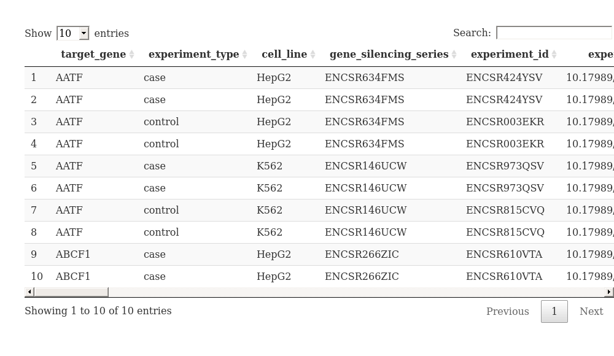

-   [Introduction](#introduction)
-   [Methods](#methods)
    -   [Prerequisites](#prerequisites)
    -   [Steps](#steps)
        -   [Step 0: Set the extraction parameters](#step-0-set-the-extraction-parameters)
        -   [Step 1: Call the ENCODE API](#step-1-call-the-encode-api)
        -   [Step 2: Generate the search summary](#step-2-generate-the-search-summary)
        -   [Step 3: Retrieval of metadata](#step-3-retrieval-of-metadata)
        -   [Step 4: Add target gene category](#AddCat)
-   [Results](#results)
    -   [Common metadata](#common-metadata)
    -   [Statistics](#statistics)
-   [Conclusions](#conclusions)
-   [Appendix 1: CRISPR metadata download](#appendix1)
-   [Session info](#session-info)

<style type="text/css">
div.main-container {
  max-width: 1800 !important;
}
</style>
<br>

Introduction
============

In this tutorial, we will use [the ENCODE REST API](https://www.encodeproject.org/help/rest-api/) to automate the metadata extraction of experiments related to shRNA knockdown against specific target genes. The functions provided can also be used to extend its functionality (see [appendix 1](#appendix1)).

<br>

Methods
=======

<br>

Prerequisites
-------------

For this tutorial, we first need the following libraries:

``` r
library(httr)
library(jsonlite)
library(foreach)
library(tibble)
library(logger)
library(tidyverse)

# ## Logger options
logger::log_threshold(logger::WARN, index = 1)
logger::log_threshold(logger::INFO, index = 2)

logger_layout <- logger::layout_glue_generator(format = '[{time}] [{level}] {msg}')
logger::log_layout(logger_layout, index = 1)
logger::log_layout(logger_layout, index = 2)

source("helperFunctions.R")
```

<br>

Steps
-----

<br>

### Step 0: Set the extraction parameters

In this step, we need to set the parameters that will determine the program's behaviour. The different options are:

-   Valid or required values:
    -   **required\_cell\_lines**: set to HepG2, K562. It requires each target gene to contain samples for both HepG2 and K562 cell lines.
    -   **valid\_target\_genes**: the specific target genes to focus the search on. Leave as an empty vector `c()` to not filter.
    -   **valid\_genome annotation**: set to `V29`.
    -   **valid\_file\_format**: set to `bam`.
    -   **valid\_output\_type**: set to `alignments`.
    -   **valid\_nucleic\_acid\_type**: set to `polyadenylated mRNA`.
-   Output files:
    -   **output\_search**: location to store the results of the ENCODE search. Set to `ENCODE_API_files/all_experiments.tsv`
    -   **output\_metadata**: location to store the metadata extraction results. Set to `ENCODE_API_files/metadata_samples.tsv`
-   Input files:
    -   **input\_target\_gene\_categories**: path to file extracted from *Van Nostrand et. al.* publication with information about the functional category of the target genes. More information [here](#AddCat).
    -   **input\_target\_gene\_NMD**: path to file which contain the list of genes categorized as relevant for nononsense-mediated decay processes.
-   Other parameters:
    -   **overwrite\_db**: whether to remove the previous metadata found. Set to `TRUE` if some API call failed during the process so that it only download what the program needs. Set to `F`.
    -   **download\_method**: it can only be set to "gene\_silencing\_series" or "experiments". It controls how the script access the API to download the information. Using the gene silencing series, we can access every control and case sample for each cell line with just one call, while using the experiments themselves needs two calls (one for cases and one for controls). It is recommended to set to gene silencing series, unless the ENCODE portal has set the access as restricted for them.

``` r
## Valid or required values
required_cell_lines <- c("HepG2", "K562")
valid_target_genes <- c() 
valid_genome_annotation <- "V29"
valid_file_format <- "bam"
valid_output_type <- "alignments"
valid_nucleic_acid_type <- "polyadenylated mRNA"

## Other parameters:
overwrite_db <- F
download_method <- "gene_silencing_series" # Other valid option is "experiments"

## Files
main_path <- "Metadata_results_tutorial/"
if(!dir.exists(main_path)) dir.create(main_path)

#### Output files
output_json <- paste0(main_path, "response.json")
output_search <- paste0(main_path, "all_experiments.tsv")
output_metadata <- paste0(main_path, "metadata_samples.tsv")

#### Input files
input_target_gene_categories <- paste0("Additional_files/Target_gene_categories.tsv")
input_target_gene_NMD <- paste0("Additional_files/NMD.txt")

## Additional logger info
log_file <- paste0(main_path, "ENCODE_API.log")
logger::log_appender(logger::appender_file(log_file, append = T), index = 2)
```

<br>

### Step 1: Call the ENCODE API

First, we need to generate an intermediary dataframe containing the information of an ENCODE search. We head to the [ENCODE experiment search portal](https://www.encodeproject.org/search/?type=Experiment), and input the different search filters we are interested in. The following filters are what the program has been tested with (additional search executed in [appendix 1](#appendix1)):

-   **Assay**:
    -   **Assay title**: shRNA RNA-seq
    -   **Target category**: RNA binding protein
    -   **Hide control experiments**: yes
-   **Biosample**:
    -   **Organism**: *Homo sapiens*
-   **Quality**:
    -   **Status**: released
-   **Other filters**:
    -   **Data Type**: Experiment

Once we have set the filters, we copy the URL and add `&limit=all&format=json` to return all search results in `json` format.

``` r
URL = "https://www.encodeproject.org/search/?type=Experiment&assay_title=shRNA+RNA-seq&target.investigated_as=RNA+binding+protein&control_type!=*&status=released&replicates.library.biosample.donor.organism.scientific_name=Homo+sapiens&limit=all&format=json"
```

Once we have decided on the URL, we execute the `getUrlResponse()` function to call the ENCODE API and convert the returned json object into an `R` list.

``` r
response_data <- getUrlResponse(URL, output_json)
```

The returned object contains all the information about the search results:

``` r
names(response_data)
```

    ##  [1] "@context"      "@graph"        "@id"           "@type"        
    ##  [5] "clear_filters" "columns"       "facet_groups"  "facets"       
    ##  [9] "filters"       "notification"  "sort"          "title"        
    ## [13] "total"

<br>

### Step 2: Generate the search summary

Once we have the json object from the ENCODE API, we can extract the relevant information and summarize it in a dataframe. To do so, we execute the function `generateSummary()`, where we specify an output path to store the results in a .tsv file format.

``` r
summary_df <- generateSummary(response_data, 
                              valid_target_genes = valid_target_genes,
                              output_file = output_search)
```

The summary dataframe contains a target gene and gene silencing series per row, and have the case experiment IDs and cell line for that given target gene. We store the gene silencing series because it contains the information of both the case and control samples, while the experiment IDs only provide information for the case samples. Here is an example of the 10 first elements of the dataframe:

<table class=" lightable-classic" style="font-family: Cambria; width: auto !important; margin-left: auto; margin-right: auto;">
<thead>
<tr>
<th style="text-align:left;">
Target gene
</th>
<th style="text-align:left;">
Experiment ID
</th>
<th style="text-align:left;">
Cell line
</th>
<th style="text-align:left;">
Gene silencing series
</th>
</tr>
</thead>
<tbody>
<tr>
<td style="text-align:left;">
AATF
</td>
<td style="text-align:left;">
ENCSR424YSV
</td>
<td style="text-align:left;">
HepG2
</td>
<td style="text-align:left;">
ENCSR634FMS
</td>
</tr>
<tr>
<td style="text-align:left;">
AATF
</td>
<td style="text-align:left;">
ENCSR973QSV
</td>
<td style="text-align:left;">
K562
</td>
<td style="text-align:left;">
ENCSR146UCW
</td>
</tr>
<tr>
<td style="text-align:left;">
ABCF1
</td>
<td style="text-align:left;">
ENCSR610VTA
</td>
<td style="text-align:left;">
HepG2
</td>
<td style="text-align:left;">
ENCSR266ZIC
</td>
</tr>
<tr>
<td style="text-align:left;">
ABCF1
</td>
<td style="text-align:left;">
ENCSR721MXZ
</td>
<td style="text-align:left;">
K562
</td>
<td style="text-align:left;">
ENCSR242RKD
</td>
</tr>
<tr>
<td style="text-align:left;">
ABT1
</td>
<td style="text-align:left;">
ENCSR756VLW
</td>
<td style="text-align:left;">
HepG2
</td>
<td style="text-align:left;">
ENCSR456IPG
</td>
</tr>
<tr>
<td style="text-align:left;">
ABT1
</td>
<td style="text-align:left;">
ENCSR233UVM
</td>
<td style="text-align:left;">
K562
</td>
<td style="text-align:left;">
ENCSR954JGH
</td>
</tr>
<tr>
<td style="text-align:left;">
ACO1
</td>
<td style="text-align:left;">
ENCSR511SYK
</td>
<td style="text-align:left;">
HepG2
</td>
<td style="text-align:left;">
ENCSR339RBD
</td>
</tr>
<tr>
<td style="text-align:left;">
ADAR
</td>
<td style="text-align:left;">
ENCSR104OLN
</td>
<td style="text-align:left;">
HepG2
</td>
<td style="text-align:left;">
ENCSR553SDV
</td>
</tr>
<tr>
<td style="text-align:left;">
ADAR
</td>
<td style="text-align:left;">
ENCSR164TLB
</td>
<td style="text-align:left;">
K562
</td>
<td style="text-align:left;">
ENCSR415ETS
</td>
</tr>
<tr>
<td style="text-align:left;">
AGO1
</td>
<td style="text-align:left;">
ENCSR533HXS
</td>
<td style="text-align:left;">
HepG2
</td>
<td style="text-align:left;">
ENCSR213SDO
</td>
</tr>
</tbody>
</table>
<br>

### Step 3: Retrieval of metadata

In this last step, we loop through every row of the summary dataframe. Since we are using the *Gene silencing series*, only one ENCODE API call for cell line is require, and we can extract all the information of both case and control samples.

``` r
metadata_df <- generateMetadata(summary_df, 
                                download_method = download_method,
                                required_cell_lines = required_cell_lines,
                                valid_file_format = valid_file_format,
                                valid_genome_annotation = valid_genome_annotation,
                                valid_output_type = valid_output_type,
                                valid_nucleic_acid_type = valid_nucleic_acid_type,
                                output_file = output_metadata,
                                overwrite_db = overwrite_db)
```

The argument `overwrite_db` of the function determines whether the previous file will be updated or overwritten. If set to `False`, the function will only retrieve the information for the missing target genes, or those which do not have exactly 8 entries. This is because sometimes the API will return bad responses, and we may not want to repeat the process for all target genes.

The other parameters regulate which files or samples we are interested in.

The returned dataframe contains the following columns:

-   **target\_gene**: the target gene of the shRNA knowckdown.
-   **experiment\_type**: whether the experiment is case or control for that particular cell line and target gene.
-   **cell\_line**: the cell type to which the knockdown was executed.
-   **gene\_silencing\_series**: the ENCODE ID of the *Gene Silencing Series* (*GSS*). Information about the *GSS* can be found in the link `https://www.encodeproject.org/gene-silencing-series/Gene_silencing_series/` (i.e. [ENCSR406ZEB](https://www.encodeproject.org/gene-silencing-series/ENCSR406ZEB/))
-   **experiment\_id**: the ENCODE ID of the experiment in particular. Information about the experiment can be found in the link `https://www.encodeproject.org/experiments/Experiment_ID/` (i.e. [ENCSR047QHX](https://www.encodeproject.org/experiments/ENCSR047QHX/))
-   **sample\_id**: the ENCODE ID of the sample in particular. Information about the sample can be found in the link `https://www.encodeproject.org/files/Sample_ID/` (i.e. [ENCFF946HGK](https://www.encodeproject.org/files/ENCFF946HGK/))
-   **RIN**: the RNA integrity number of the sample. It measures the integrity of the RNA measurements.
-   **read\_depth**: number of reads per sample.
-   **bio\_rep**: the isogenic replicate of the sample.
-   **tech\_rep**: the technical replicate of the sample.
-   **sex**: the sex of the sample donor.
-   **age**: the age of the sample donor.
-   **life\_stage**: the life stage of the sample donor.
-   **gene\_quantification\_id**: the ENCODE ID of the associated gene quantification file. It is employed to download the gene expressions (in TPM) before and after the knockdown, to study the efficiency.
-   **file\_format**: format of the selected sample.
-   **output\_type**: output type of the selected sample.
-   **genome\_annotation**: genome annotation of the selected sample.
-   **mapped\_run\_type**: mapped run type of the selected sample.
-   **lab**: laboratory where the selected sample was produced.
-   **assay**: assay of the selected sample.
-   **cellosaurus**: cellosaurus ID of the sample. Usually describes the cell line.
-   **biosample**: the ENCODE ID of the biosample from which a case sample was generated.
-   **document**: ID of the biosample preparation and characterization document from which the reported knockdown efficiency from ENCODE is extracted.

More information about the metadata provided by ENCODE can be found in their [*Terms and Definitions*](https://www.encodeproject.org/data-standards/terms/) portal.

<br>

### Step 4: Add target gene category

Additionally, we can add a target gene category based on *Van Nostrand et. al.* [A large-scale binding and functional map of human RNA-binding proteins](https://www.nature.com/articles/s41586-020-2077-3) publication, which adds a category for whether it is relevant for *Splicing regulation*, the *Spliceosome* or an *Exon Junction Complex* (not mutually exclusive). If provided with a list of NMD genes, it will also classify the target genes in this category.

``` r
metadata_df <- addTargetGeneCategory(metadata_df,
                                     input_target_gene_categories,
                                     input_target_gene_NMD,
                                     output_metadata)
```

The final dataframe is stores in a .tsv file if provided in the `output_file` argument.

<br>

Results
=======

The final results can be seen in the following table:

``` r
prettier_DT(metadata_df[1:10, ])
```



``` r
# metadata_df[1:10, ] %>%
#   kableExtra::kbl() %>%
#   kableExtra::kable_classic(full_width = F, html_font = "Cambria")
```

<br>

Common metadata
---------------

As seen in the table, every row corresponds to a sample related to both a target gene, a cell line and an experiment type. Given our requirements, all rows have a file format of `bam`, an output type of `alignments` and a genome annotation of `V29`. When we study common aspects between the different samples, we observe a clear difference between the two cell lines: **all samples extracted from a same cell line comes from the same donor (sex and age), and from the same tissue (explained in the cellosaurus).**

<table class=" lightable-classic" style="font-family: Cambria; width: auto !important; margin-left: auto; margin-right: auto;">
<thead>
<tr>
<th style="text-align:left;">
cell\_line
</th>
<th style="text-align:left;">
sex
</th>
<th style="text-align:left;">
age
</th>
<th style="text-align:left;">
cellosaurus
</th>
</tr>
</thead>
<tbody>
<tr>
<td style="text-align:left;">
HepG2
</td>
<td style="text-align:left;">
male
</td>
<td style="text-align:left;">
15
</td>
<td style="text-align:left;">
Cellosaurus:CVCL\_0027
</td>
</tr>
<tr>
<td style="text-align:left;">
K562
</td>
<td style="text-align:left;">
female
</td>
<td style="text-align:left;">
53
</td>
<td style="text-align:left;">
Cellosaurus:CVCL\_0004
</td>
</tr>
</tbody>
</table>
Each cellosaurus corresponds to a different tissue:

-   **[CVCL\_0004](https://www.cellosaurus.org/CVCL_0004)**: derived from *Pleural effusion*.
-   **[CVCL\_0027](https://www.cellosaurus.org/CVCL_0027)**: derived from *Liver*.

Other parameters that are constant across the different samples (independently of the cell line) are: the mapped run type, the lab, the assay, the nucleic acid type (required), the extraction method, the fragmentation method, the size selection method and the strand specificity.

<table class=" lightable-classic" style="font-family: Cambria; width: auto !important; margin-left: auto; margin-right: auto;">
<thead>
<tr>
<th style="text-align:left;">
mapped\_run\_type
</th>
<th style="text-align:left;">
lab
</th>
<th style="text-align:left;">
assay
</th>
<th style="text-align:left;">
nucleic\_acid\_type
</th>
<th style="text-align:left;">
extraction\_method
</th>
<th style="text-align:left;">
fragmentation\_method
</th>
<th style="text-align:left;">
size\_selection\_method
</th>
<th style="text-align:left;">
strand\_specificity
</th>
</tr>
</thead>
<tbody>
<tr>
<td style="text-align:left;">
paired-ended
</td>
<td style="text-align:left;">
Brenton Graveley, UConn
</td>
<td style="text-align:left;">
shRNA knockdown followed by RNA-seq
</td>
<td style="text-align:left;">
polyadenylated mRNA
</td>
<td style="text-align:left;">
Maxwell 16 LEV simpleRNA Cells Kit (Promega cat\#: AS1270)
</td>
<td style="text-align:left;">
chemical (Illumina TruSeq)
</td>
<td style="text-align:left;">
SPRI beads
</td>
<td style="text-align:left;">
reverse
</td>
</tr>
</tbody>
</table>
<br>

Statistics
----------

The total number of target gene founds under our conditions is 160 (for a total of 1284 samples).

The average RIN is 9.62 \[7-10\], considerably high. We do find an experiment without a RIN (experiment ENCSR438UOT, case samples for target gene XPO1 and cell line HepG2), which we define as `NA`.

If we added the target gene categories, we have a total of 38 marked as *Splicing regulation*, 19 marked as *Spliceosome*, 1 marked as *Exon junction complex* and 7 marked as *NMD*. If we combine all these categories, a total of 51 target genes:

    ##  [1] "ADAR"     "AQR"      "BUD13"    "CELF1"    "DAZAP1"   "EFTUD2"  
    ##  [7] "EIF4G1"   "EWSR1"    "FUBP1"    "GEMIN5"   "GPKOW"    "HNRNPC"  
    ## [13] "HNRNPU"   "KHDRBS1"  "KHSRP"    "MAGOH"    "MATR3"    "NCBP2"   
    ## [19] "NONO"     "PABPC1"   "PCBP1"    "PCBP2"    "PPIG"     "PRPF4"   
    ## [25] "PRPF6"    "PSIP1"    "PTBP1"    "PUF60"    "QKI"      "RAVER1"  
    ## [31] "RBM15"    "RBM22"    "RBM39"    "RPS10"    "RPS19"    "RPS3A"   
    ## [37] "SART3"    "SF1"      "SF3A3"    "SF3B4"    "SMN1"     "SMNDC1"  
    ## [43] "SND1"     "SNRNP200" "SRSF1"    "SUGP2"    "TARDBP"   "TIAL1"   
    ## [49] "U2AF1"    "U2AF2"    "ZRANB2"

<br>

Conclusions
===========

With the developed script, it is possible to automate the ENCODE RBP metadata extraction using the [the ENCODE REST API](https://www.encodeproject.org/help/rest-api/). It is also proven that the samples share relevant aspects to allow their direct comparison.

<br>

Appendix 1: CRISPR metadata download
====================================

Aditionally, the software was tested to download the metadata from CRISPR knockdown. There are a few considerations we would have to keep in mind:

-   Some gene silencing series from the CRISPR projects are not public. As such, we have to set the `download_method` to `experiments`, so that the metadata is extracting from the experiment page, and not from the gene silencing series.
-   We need to provide a different URL for the search. More precisile, we need to modify the "Assay title" from `shRNA RNA-seq` to `CRISPR RNA-seq`. Other than that, everything else is the same.

With these modifications in mind, the following script will download all metadata found for CRISPR projects where two cell lines are found, each with 4 samples (2 case and 2 control).

``` r
## Valid or required values
required_cell_lines <- c("HepG2", "K562")
valid_target_genes <- c() 
valid_genome_annotation <- "V29"
valid_file_format <- "bam"
valid_output_type <- "alignments"
valid_nucleic_acid_type <- "polyadenylated mRNA"

## Other parameters:
overwrite_db <- F
download_method <- "experiments"

## Files
main_path <- "Metadata_results_CRISPR/"
if(!dir.exists(main_path)) dir.create(main_path)

#### Output files
output_json <- paste0(main_path, "response.json")
output_search <- paste0(main_path, "all_experiments.tsv")
output_metadata <- paste0(main_path, "metadata_samples.tsv")

#### Input files
input_target_gene_categories <- paste0("Additional_files/Target_gene_categories.tsv")
input_target_gene_NMD <- paste0("Additional_files/NMD.txt")

## URL to CRISPR experiments
URL = "https://www.encodeproject.org/search/?status=released&type=Experiment&target.investigated_as=RNA+binding+protein&replicates.library.biosample.donor.organism.scientific_name=Homo+sapiens&assay_title=CRISPR+RNA-seq&limit=all&format=json"

## Pipeline
response_data <- getUrlResponse(URL, output_json)
summary_df <- generateSummary(response_data, 
                              valid_target_genes = valid_target_genes,
                              output_file = output_search)
metadata_df <- generateMetadata(summary_df, 
                                download_method = download_method,
                                required_cell_lines = required_cell_lines,
                                valid_file_format = valid_file_format,
                                valid_genome_annotation = valid_genome_annotation,
                                valid_output_type = valid_output_type,
                                valid_nucleic_acid_type = valid_nucleic_acid_type,
                                output_file = output_metadata, 
                                overwrite_db = overwrite_db)
metadata_df <- addTargetGeneCategory(metadata_df,
                                     input_target_gene_categories,
                                     input_target_gene_NMD,
                                     output_metadata)
```

<br>

Session info
============

<details> <summary>Show/hide</summary>

    ## ─ Session info ───────────────────────────────────────────────────────────────────────────────────────────────────────
    ##  setting  value
    ##  version  R version 4.0.5 (2021-03-31)
    ##  os       Ubuntu 16.04.7 LTS
    ##  system   x86_64, linux-gnu
    ##  ui       X11
    ##  language (EN)
    ##  collate  en_GB.UTF-8
    ##  ctype    en_GB.UTF-8
    ##  tz       Europe/London
    ##  date     2023-01-01
    ##  pandoc   1.19.2.1 @ /usr/lib/rstudio-server/bin/pandoc/ (via rmarkdown)
    ## 
    ## ─ Packages ───────────────────────────────────────────────────────────────────────────────────────────────────────────
    ##  package       * version date (UTC) lib source
    ##  assertthat      0.2.1   2019-03-21 [2] CRAN (R 4.0.5)
    ##  backports       1.4.1   2021-12-13 [1] CRAN (R 4.0.5)
    ##  bit             4.0.4   2020-08-04 [2] CRAN (R 4.0.5)
    ##  bit64           4.0.5   2020-08-30 [2] CRAN (R 4.0.5)
    ##  broom           1.0.1   2022-08-29 [1] CRAN (R 4.0.5)
    ##  bslib           0.4.1   2022-11-02 [1] CRAN (R 4.0.5)
    ##  cachem          1.0.5   2021-05-15 [2] CRAN (R 4.0.5)
    ##  callr           3.7.3   2022-11-02 [1] CRAN (R 4.0.5)
    ##  cellranger      1.1.0   2016-07-27 [2] CRAN (R 4.0.5)
    ##  cli             3.4.1   2022-09-23 [1] CRAN (R 4.0.5)
    ##  codetools       0.2-18  2020-11-04 [2] CRAN (R 4.0.5)
    ##  colorspace      2.0-3   2022-02-21 [1] CRAN (R 4.0.5)
    ##  crayon          1.5.2   2022-09-29 [1] CRAN (R 4.0.5)
    ##  crosstalk       1.1.1   2021-01-12 [2] CRAN (R 4.0.5)
    ##  curl            4.3.2   2021-06-23 [2] CRAN (R 4.0.5)
    ##  DBI             1.1.1   2021-01-15 [2] CRAN (R 4.0.5)
    ##  dbplyr          2.1.1   2021-04-06 [2] CRAN (R 4.0.5)
    ##  digest          0.6.31  2022-12-11 [1] CRAN (R 4.0.5)
    ##  dplyr         * 1.0.10  2022-09-01 [1] CRAN (R 4.0.5)
    ##  DT              0.18    2021-04-14 [2] CRAN (R 4.0.5)
    ##  ellipsis        0.3.2   2021-04-29 [2] CRAN (R 4.0.5)
    ##  evaluate        0.19    2022-12-13 [1] CRAN (R 4.0.5)
    ##  fansi           1.0.3   2022-03-24 [1] CRAN (R 4.0.5)
    ##  fastmap         1.1.0   2021-01-25 [2] CRAN (R 4.0.5)
    ##  forcats       * 0.5.1   2021-01-27 [2] CRAN (R 4.0.5)
    ##  foreach       * 1.5.1   2020-10-15 [2] CRAN (R 4.0.5)
    ##  fs              1.5.2   2021-12-08 [1] CRAN (R 4.0.5)
    ##  gargle          1.2.0   2021-07-02 [2] CRAN (R 4.0.5)
    ##  generics        0.1.3   2022-07-05 [1] CRAN (R 4.0.5)
    ##  ggplot2       * 3.4.0   2022-11-04 [1] CRAN (R 4.0.5)
    ##  glue            1.6.2   2022-02-24 [1] CRAN (R 4.0.5)
    ##  googledrive     2.0.0   2021-07-08 [2] CRAN (R 4.0.5)
    ##  googlesheets4   1.0.0   2021-07-21 [2] CRAN (R 4.0.5)
    ##  gtable          0.3.1   2022-09-01 [1] CRAN (R 4.0.5)
    ##  haven           2.5.1   2022-08-22 [1] CRAN (R 4.0.5)
    ##  highr           0.9     2021-04-16 [2] CRAN (R 4.0.5)
    ##  hms             1.1.2   2022-08-19 [1] CRAN (R 4.0.5)
    ##  htmltools       0.5.4   2022-12-07 [1] CRAN (R 4.0.5)
    ##  htmlwidgets     1.5.3   2020-12-10 [2] CRAN (R 4.0.5)
    ##  httr          * 1.4.2   2020-07-20 [2] CRAN (R 4.0.5)
    ##  iterators       1.0.13  2020-10-15 [2] CRAN (R 4.0.5)
    ##  jquerylib       0.1.4   2021-04-26 [2] CRAN (R 4.0.5)
    ##  jsonlite      * 1.8.4   2022-12-06 [1] CRAN (R 4.0.5)
    ##  kableExtra      1.3.4   2021-02-20 [1] CRAN (R 4.0.5)
    ##  knitr           1.41    2022-11-18 [1] CRAN (R 4.0.5)
    ##  lifecycle       1.0.3   2022-10-07 [1] CRAN (R 4.0.5)
    ##  logger        * 0.2.2   2021-10-19 [1] CRAN (R 4.0.5)
    ##  lubridate       1.9.0   2022-11-06 [1] CRAN (R 4.0.5)
    ##  magrittr        2.0.3   2022-03-30 [1] CRAN (R 4.0.5)
    ##  modelr          0.1.8   2020-05-19 [2] CRAN (R 4.0.5)
    ##  munsell         0.5.0   2018-06-12 [2] CRAN (R 4.0.5)
    ##  pillar          1.8.1   2022-08-19 [1] CRAN (R 4.0.5)
    ##  pkgconfig       2.0.3   2019-09-22 [2] CRAN (R 4.0.5)
    ##  processx        3.8.0   2022-10-26 [1] CRAN (R 4.0.5)
    ##  ps              1.7.2   2022-10-26 [1] CRAN (R 4.0.5)
    ##  purrr         * 0.3.5   2022-10-06 [1] CRAN (R 4.0.5)
    ##  R6              2.5.1   2021-08-19 [1] CRAN (R 4.0.5)
    ##  Rcpp            1.0.9   2022-07-08 [1] CRAN (R 4.0.5)
    ##  readr         * 2.1.3   2022-10-01 [1] CRAN (R 4.0.5)
    ##  readxl          1.3.1   2019-03-13 [2] CRAN (R 4.0.5)
    ##  reprex          2.0.2   2022-08-17 [1] CRAN (R 4.0.5)
    ##  rlang           1.0.6   2022-09-24 [1] CRAN (R 4.0.5)
    ##  rmarkdown       2.9     2021-06-15 [2] CRAN (R 4.0.5)
    ##  rstudioapi      0.13    2020-11-12 [2] CRAN (R 4.0.5)
    ##  rvest           1.0.3   2022-08-19 [1] CRAN (R 4.0.5)
    ##  sass            0.4.0   2021-05-12 [2] CRAN (R 4.0.5)
    ##  scales          1.2.1   2022-08-20 [1] CRAN (R 4.0.5)
    ##  sessioninfo   * 1.2.2   2021-12-06 [1] CRAN (R 4.0.5)
    ##  stringi         1.7.8   2022-07-11 [1] CRAN (R 4.0.5)
    ##  stringr       * 1.5.0   2022-12-02 [1] CRAN (R 4.0.5)
    ##  svglite         2.1.0   2022-02-03 [1] CRAN (R 4.0.5)
    ##  systemfonts     1.0.4   2022-02-11 [1] CRAN (R 4.0.5)
    ##  tibble        * 3.1.8   2022-07-22 [1] CRAN (R 4.0.5)
    ##  tidyr         * 1.2.1   2022-09-08 [1] CRAN (R 4.0.5)
    ##  tidyselect      1.2.0   2022-10-10 [1] CRAN (R 4.0.5)
    ##  tidyverse     * 1.3.2   2022-07-18 [1] CRAN (R 4.0.5)
    ##  timechange      0.1.1   2022-11-04 [1] CRAN (R 4.0.5)
    ##  tzdb            0.1.2   2021-07-20 [2] CRAN (R 4.0.5)
    ##  utf8            1.2.2   2021-07-24 [2] CRAN (R 4.0.5)
    ##  vctrs           0.5.1   2022-11-16 [1] CRAN (R 4.0.5)
    ##  viridisLite     0.4.1   2022-08-22 [1] CRAN (R 4.0.5)
    ##  vroom           1.6.0   2022-09-30 [1] CRAN (R 4.0.5)
    ##  webshot         0.5.4   2022-09-26 [1] CRAN (R 4.0.5)
    ##  withr           2.5.0   2022-03-03 [1] CRAN (R 4.0.5)
    ##  xfun            0.35    2022-11-16 [1] CRAN (R 4.0.5)
    ##  xml2            1.3.3   2021-11-30 [1] CRAN (R 4.0.5)
    ##  yaml            2.3.6   2022-10-18 [1] CRAN (R 4.0.5)
    ## 
    ##  [1] /home/grocamora/R/x86_64-pc-linux-gnu-library/4.0
    ##  [2] /opt/R/4.0.5/lib/R/library
    ## 
    ## ──────────────────────────────────────────────────────────────────────────────────────────────────────────────────────

</details>
